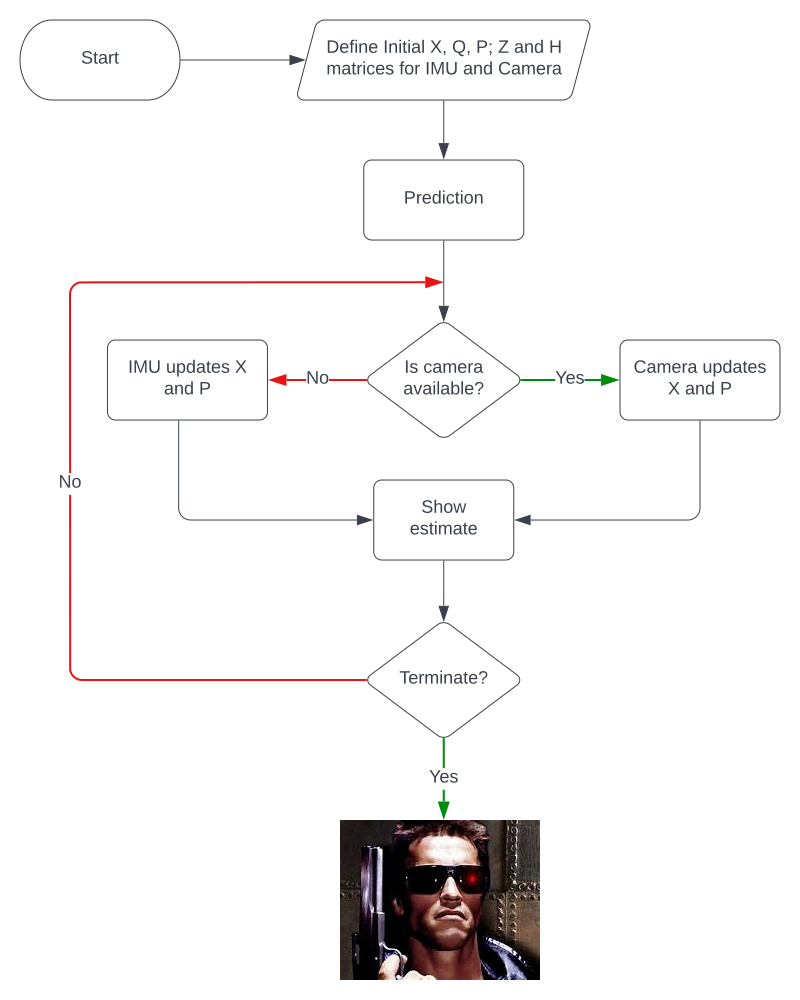
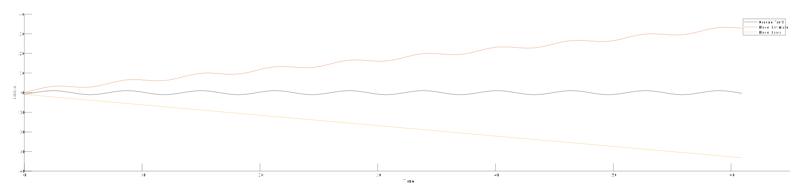
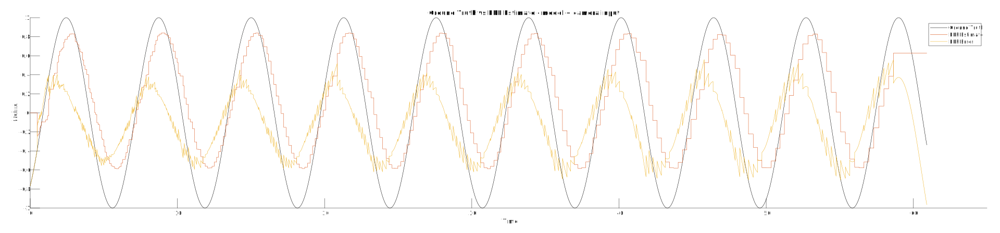

# MEEN 689 - Robotic Perception Project
Term project repository for MEEN 689.

## Problem

In an empty world, we have a chair that has a linear oscillating motion. This chair is equipped with and Inertial Measurement Unit. and is being observed by a camera.

## Objective

To write a Kalman filter to combine the data from the camera and the IMU to estimate the position of the chair at any given time.

## Execution

### State Prediction

#### Prediction Equation

$$ State  = X_k = \begin{bmatrix} x_k \cr \dot x_k \cr \ddot x_k \end{bmatrix} $$
$$ X_k = \begin{bmatrix} x_k + (\dot x_k + adt)dt \cr \dot x_k + adt \cr a \end{bmatrix} $$

$$ X_k =\begin{bmatrix} 1 & dt & 0 \cr 0 & 1 & 0 \cr 0 & 0 & 0 \end{bmatrix} \begin{bmatrix} x_{k+1}\cr \dot x_{k+1} \cr \ddot x_{k+1} \end{bmatrix} + \begin{bmatrix} adt^2 \cr adt \cr a\end{bmatrix} + \omega_k$$

$$\omega_k = N(0, Q) $$

#### Prediction Covariance

$$ Q = \begin{bmatrix} 25dt^4 & 50dt^3 & 0 \cr 50dt^3 & 100dt^2 & 0 \cr 0 & 0 & 0\end{bmatrix}$$

#### Priori Covariance

$$ P_0 =\begin{bmatrix} 1 & dt & 0 \cr 0 & 1 & 0 \cr 0 & 1 & 0 \end{bmatrix}  \begin{bmatrix} X_{k+1} \cr \dot X_{k+1} \cr \ddot X_{k+1} \end{bmatrix} + \omega_k$$

#### Measurement: IMU
From the IMU we are accepting linear acceleration to get a position estimate by using a normal Kalman Filter. This measurement needs to be updated in the Kalman Filter, and is shown by the following measurement update equation.

$$ Z_{IMU} = \begin{bmatrix} 0 & 0 & 1\end{bmatrix} \begin{bmatrix} x_{k+1} \cr \dot x_{k+1} \cr \ddot x_{k+1}\end{bmatrix} + V_{IMU} $$

where $V_{IMU}$ is the sensor noise with covariance $$R_{IMU} = 0.25$$

#### Measurement: Camera
We have YOLOv5 running on the camera output to recognize the chair ang give us a bounding box. Based on this bounding box, we are identifying the position of the chair by finding the centre and the deviation from its last state to measure it's displacement. This gives us one input for the chair's position. Since we are identifying position from angular deviation, a non-linear function is used, and hence a Extended Kalman Filter is implemented here.

We are assuming that the chair has a linear motion. Based on this, it's displacement from the optical center of the camera can be given by;

$$ u = \frac{\tan^{-1} \begin{pmatrix}\frac{x}{d}\end{pmatrix}}{\alpha}   $$

As we have no other input from the camera, the obtained Jacobian H is given by,

$$ H = \begin{bmatrix} \frac{d}{\alpha(x^2 + d^2)} & 0 & 0 \end{bmatrix} $$

with a covariance of $ R_{Cam} = 0.1 $

We are leaning on the camera as it gives a direct measurement for position, and has no elements for distortation. We have therefore assigned a higher confidence in its measurements

### Control Flowchart

## Results

To quantify the performance of the filter, we observe the error in the estimate with respect to the ground truth in two scenarios - first, where we have estimates based on the model alone, and second with estimates from the model and camera. 

As is apparent, the Kalman filter based on the model alone performs poorly, mostly due to angular random walk imparted by the IMU.

This error is corrected to a signifcantly lower value by the addition of camera data

The resultant errors are as follows

